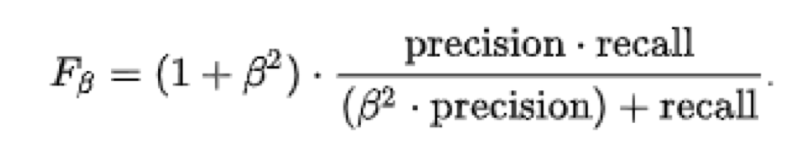

# **E-commerce Churn Prediction**

## Stage 1 - EDA

Pada tahap ini dilakukan proses analisis untuk memahami karakteristik data agar data tersebut dapat digunakan untuk proses pembelajaran model tanpa mengubah nilai ataupun informasi dari data yang diperoleh. Kami melakukan analisa dengan menggunakan data yang kami peroleh [disini](https://www.kaggle.com/datasets/ankitverma2010/ecommerce-customer-churn-analysis-and-prediction). Pada tahap ini kami melakukan analisa melalui beberapa langkah, antara lain:

### 1. Statistical Descriptive

Untuk dapat memahami karakteristik data, kita dapat melihat dari ringkasan statistik dari setiap kolom yang memberikan gambaran besar keadaan data. Kami menggunakan `df.info()` dan `df.describe()` untuk melihat informasi serta ringkasan statistik pada data.

Setelah melihat ringkasan statistik dari setiap kolom, kami memperoleh beberapa informasi sebagai berikut:

1. Terdapat beberapa kolom yang perlu diubah tipe datanya:
   - CustomerID → object
   - CityTier → Object
   - CouponUsed → Int64
   - DaySinceLastOrder → Int64
   - OrderCount → int64
2. Terdapat beberapa kolom yang memiliki null value seperti: 
   - Tenure
   - WarehouseToHome
   - HourSpendOnApp
   - OrderAmountHikeFromlastYear
   - CouponUsed
   - OrderCount
   - DaySinceLastOrder
   - CashbackAmount
3. Terdapat beberapa kolom yang memiliki data yang agak aneh seperti:
   - WarehouseToHome, nilai mean (15.6) berbeda jauh dengan nilai max (127)
   - NumberOfAddress, nilai mean (4.2) berbeda jauh dengan nilai max (22)
   
### 2. Univariate Analysis

Selain melihat ringkasan statistik dari tiap kolom, kita juga dapat melakukan visualisasi pada tiap kolom sehingga dapat melihat distibusi nilainya secara detail. Kami menggunakan `boxplot` untuk melihat nilai outliers dan `kdeplot` untuk melihat distribusi data pada tiap kolom. Pada data ketegorikal kami menggunakan `countplot` untuk melihat distribusi datanya.

Setelah melakukan analisa, kami memperoleh beberapa informasi sebagai berikut:

1. Hampir keseluruhan feature memiliki nilai outliers kecuali SatisfactionScore
2. Terdapat beberapa feature yang memiliki distribusi right skew, seperti:
   - Tenure
   - WarehouseToHome
   - NumberOfAddress
   - OrderAmountHikeFromlastYear
   - CouponUsed
   - OrderCount
   - DaySinceLastOrder
3. Terdapat beberapa feature yang memiliki bimodal, seperti HourSpendOnApp, NumberOfDeviceRegistered dan SatisfactionScore
4. Pada feature kategorikal terdapat beberapa kolom yang memiliki kategori yang serupa seperti:
    - PreferredLoginDevice → (Mobile Phone - Phone)
    - PreferredPaymentMethod → (Cash on Delivery - COD) dan (CC dan Credit Card)
    - PreferredOrderCat → (Mobile - Mobile Phone)
    
### 3. Multivariate Analysis

Selanjutnya kami melakukan analisis beberapa kolom sekaligus untuk mengetahui hubungan antar kolom baik antara feature dengan target maupun korelasi pada tiap kolomnya. Kami menggunakan `heatmap` untuk melihat nilai korelasi pada tiap kolomnya dan `barplot` untuk membandingkan data antara dua kolom.

Setelah melakukan analisa, kami memperoleh beberapa informasi sebagai berikut:

1. Terdapat korelasi yang cukup kuat antara feature Tenure dan label (Churn) sebesar -0.35 (negative correlation) yang berarti semakin tinggi nilai tenure maka semakin kecil kemungkinan untuk churn.
2. Terdapat korelasi antara feature Complain dan label (Churn) sebesar 0.25 (positive correlation) yang berarti semakin tinggi nilai complain, semakin tinggi kemungkinan untuk churn.
3. Customer yang berada pada CityTier 3 memiliki kemungkinan Churn tertinggi yaitu sebesar 21.4%
4. Customer laki-laki memiliki kemungkinan Churn yang lebih tinggi yaitu sebesar 17.7%
5. Customer yang melakukan Complain memiliki kemungkinan Churn yang lebih tinggi yaitu sebesar 31.7%
6. Customer yang menggunakan metode pembayaran COD kemungkinan Churn tertinggi yaitu 28.8%
7. Customer yang melakukan transaksi pada kategori Mobile dan Mobile Phone memiliki kemungkinan untuk Churn di atas 27%
8. Customer dengan status Single memiliki kemungkinan Churn yang lebih tinggi yaitu 26.7%
9. Customer yang Churn memiliki jarak yang lebih jauh dengan rata-rata jarak sebesar 17.13
10. Customer yang Churn melakukan order yang lebih sedikit dengan rata-rata order sebesar 2.82
11. Customer yang Churn mendapatkan Cashback yang lebih sedikit dengan rata-rata Cashback sebesar 160.37
12. Customer yang memiliki Tenure di bawah 5 memiliki kemungkinan untuk Churn sangat tinggi dan semakin lama masa berlangganan maka semakin sedikit pula kemungkinan Customer untuk Churn.

## Stage 2 - Data Preprocessing

Pada tahap ini dilakukan modifikasi data untuk memudahkan dalam proses modelling nantinya, dengan mengubah, menambahkan ataupun mengurangi fitur yang diperlukan. Beberapa hal yang kami lakukan dalam proses modifikasi tersebut antara lain:

### 1. Data Cleaning

Pada proses *data cleaning*, kami melakukan beberapa hal, yaitu:

#### Handle Missing Value

Berdasarkan hasil Statistical Descriptive, maka yang akan kami lakukan untuk mengatasi *missing value* sebagai berikut:
- `Tenure`: Imputasi menggunakan nilai median karena memiliki distribusi skewed
- `WarehouseToHome`: Imputasi menggunakan nilai median karena memiliki distribusi skewed
- `OrderAmountHikeFromlastYear`: Imputasi menggunakan nilai median karena memiliki distribusi skewed
- `CouponUsed`: Imputasi menggunakan nilai median karena memiliki distribusi skewed
- `OrderCount`: Imputasi menggunakan nilai median karena memiliki distribusi skewed
- `DaySinceLastOrder`: Imputasi menggunakan nilai median karena memiliki distribusi skewed
- `HourSpendOnApp`: Imputasi menggunakan nilai modus

#### Handling Duplicated Data

Pada proses *handling duplicated data*, setelah melakukan pengecekan duplikat data pada fitur `CustomerID` kami tidak menemukan adanya data yang duplikat.

#### Handling Outliers

Pada proses *handling outliers* kami menggunakan 2 metode yaitu IQR dan Z-Score, dan didapatkan hasil sebagai berikut:
- IQR: data yang terbuang sebanyak 1590 atau sebesar 28.2%
- Z-score: data yang terbuang sebanyak 282 atau sebesar 5%

Kami memutuskan menggunakan nilai **Z-score** untuk mengatasi nilai outliers dikarenakan jumlah data yang terbuang jauh lebih kecil dibandingkan IQR.

### 2. Feature Extraction

Dari hasil EDA, terdapat beberapa feature yang memerlukan penyesuaian seperti:
- `PreferredLoginDevice`, menggabungkan kategori **Phone** dan **Mobile Phone** -> **Phone**
- `PreferredPaymentMode`, menggabungkan kategori **CC** dan **Credit Card** -> **Credit Card**
- `PreferredPaymentMode`, menggabungkan ketegori **COD** dan **Cash on Delivery** -> **Cash on Delivery**
- `PreferedOrderCat`, menggabungkan kategori **Mobile** dan **Mobile Phone** -> **Mobile Phone**
- `MaritalStatus`, Menggabungkan ketegori **Divorced** dan **Single** -> **Single**

Terdapat feature baru yang bisa dibuat, antara lain:
- `AvgCashback`, Rata-rata cashback per item (`CashbackAmount` / `OrderCount`)

### 3. Feature Transformation

Pada proses *feature transformation* kami melakukan **log transformation** serta **standardization** untuk fitur-fitur tertentu.

- Log transformation: `WarehouseToHome` dan `AvgCashback` karena memiliki long right tailed.
- Standardization: Semua kolom yang right skew dan kolom yang telah di log transformasi.

### 4. Feature Encoding

Pada proses *feature encoding* kami melakukan perubahan pada fitur-fitur yang bersifat kategorikal, menjadi numerikal.

- Label Encoding: `Gender`, `MaritalStatus`
- One Hot Encoder: `PreferredLoginDevice`, `PreferredPaymentMode`, `PreferedOrderCat`

### 5. Feature Selection

Berdasarkan nilai korelasi pada heatmap, feature yang memiliki korelasi tertinggi dengan target adalah `Tenure_st` dengan nilai **-0.34**. Oleh karena itu, kami memutuskan untuk membuang feature yang memiliki korelasi dibawah **0.1**. Sehingga hanya terdapat 9 feature yang akan kami gunakan pada tahap selanjutnya.

### 6. Handling Imbalance Data

Dari nilai yang didapatkan berdasarkan `value_counts`, ada ketimpangan data pada target yaitu kolom `Churn`. Dimana customer yang Churn hanya sebesar 17% dari keseluruhan data pada target. Untuk mengatasinya akan dilakukan oversampling menggunakan SMOTE sehingga dapat meminimalisir terjadinya data duplikat.

## **Stage 3 - Modeling**

Pada tahap ini dilakukan pemodelan pada dataset yang sebelumnya telah dilakukan preprocessing, sehingga dataset yang digunakan tidak terdapat nilai null ataupun duplikat. Langkah-langkah yang dilakukan pada proses modeling antara lain:

### **1. Split Data Train & Data Test**

Proses *split data* dilakukan sebelum *handling imbalance data*. Data setelah *preprocessing* berjumlah **5348 *rows***, kami melakukan pembagian untuk data train sebanyak **70%** dan data test sebanyak **30%**. Dari pembagian tersebut didapatkan:

- `X_train: 4278 row dan 11 columns`
- `y_train: 4278 row`
- `X_test: 1070 rows dan 11 columns`
- `y_test: 1070 rows`

Kemudian dilakukan *oversampling* untuk mengatasi ketimpangan nilai pada target dan didapatkan data sebagai berikut:

- `X_smote: 7104 rows dan 11 columns`
- `y_smote: 7104 rows  (0 → 3552, 1 → 3552)`

Data tersebut yang akan digunakan untuk pembelajaran model dalam memprediksi target.

### **2. Penentuan Metrics**

Kami lebih menitik beratkan pada evaluasi *metrics* *recall* yang bertujuan untuk menghindari atau **mengurangi nilai true negative** pada prediksi customer yang churn. Karena nilai true negative berarti customer tersebut diprediksi tidak churn tetapi kenyataannya churn dan hal tersebut akan membuat perusahan kehilangan customer yang ada. 

Oleh karena itu kami memilih untuk menggunakan *metrics* **Fbeta score** untuk mengevaluasi model kami. Fbeta score kami pilih karena *metrics* tersebut berfokus pada data yang imbalance dan mengevaluasi *metrics* *recall* dan precision. Nilai beta yang kami gunakan adalah 2 sehingga *metrics* ini biasa disebut juga **F2 Score**. Berikut adalah rumus fbeta score:

### **3. Implementasi Algoritma**

Berdasarkan data yang kami gunakan, terdapat target yang memiliki tipe data kategorikal maka *machine learning* yang akan kami terapkan merupakan jenis **Supervised Learning: Classification**. Terdapat beberapa algoritma yang akan kami gunakan dalam permodelan diantaranya:

- Logistic Regression
- K-Nearest Neighbor
- Desicion Tree
- Random Forest
- Ada Boost
- Gradient Boosting
- XG Boost

Setelah dilakukan implementasi pemodelan terhadap berbagai algoritma diatas, kami memutuskan untuk memilih algoritma **XGboost** dengan perbandingan F2-Score pada data test dan data train berturut-turut adalah **0.887** dan **0.895**.  
Kemudian setelah dilakukan *Hyperparameter Tuning* pada algoritma XGBoost, diperoleh nilai F2-Score yang lebih bagus pada data test dan data train berturut-turut yaitu **0.959** dan **0.998**.

Sebelum menggunakan model, kita memiliki:
- `(True Positive)` 948 customers
- `(False Positive)` 4682 customers  
Jadi secara keseluruhan kita harus menjangkau **5630 customers** dalam upaya mencegah customer churn.

Sedangkan setelah di modelling, kita memiliki:
- `(True Positive)` 864 customers
- `(False Positive)` 65 customers  
Jadi secara keseluruhan kita hanya perlu menjangkau **929 customers**, dengan persentase customer churn sebesar **93%**

Dengan begini kita dapat melakukan pendekatan kepada customer secara lebih tepat, dan juga mengurangi marketing cost yang tidak on point.

### **4. Feature Importances**

Setelah selesai melakukan pemodelan, untuk penarikan *insight* kami mengambil dari *feature importances*.  
Insight yang kami tampilkan dibagi menjadi 2, yaitu ***feature importance insight*** dan ***business recommendation***.  

***Feature importance insight:***
- `Tenure`: Semakin tinggi nilai tenure, semakin rendah dampaknya terhadap churn. Dengan demikian, kami menyarankan agar perusahaan dapat meningkatkan durasi sejak pembelian pertama customer tersebut ke pembelian terakhir. Artinya, customer tersebut sudah lama menjadi customer perusahaan tersebut. Untuk meningkatkan hal ini, perlu usaha jangka panjang agar dapat mempertahankan customer tersebut dan mendorong pembelian dengan memberikan berbagai macam bentuk promosi. Langkah ini dapat membantu agar customer tidak churn.

- `Complain`: Semakin tinggi nilai complain, semakin besar dampaknya terhadap churn.  Dengan demikian, kami menyarankan agar perusahaan dapat mengambil langkah untuk menurunkan complain dari customer. Hal ini dapat dilakukan dengan meningkatkan kualitas pelayanan yang diberikan dan pengalaman yang dirasakan customer ketika melakukan pembelian di ecommerce. 

- `CashbackAmount`: Semakin rendah nilai cashback, semakin tinggi dampaknya terhadap churn. Artinya, perusahaan perlu memberikan cashback agar kemungkinan customer akan churn semakin rendah. 

- `PreferedOrderCat_Laptop & Accessory`,  PreferedOrderCat_Handphone & Accessory, PreferedOrderCat_Grocery: Semakin tinggi nilai fitur ini, semakin rendah dampaknya terhadap churn. Dengan demikian, perusahaan perlu meningkatkan promosi pada kategori laptop & accessory, handphone & accessory, serta grocery agar pembelian meningkat dan customer tidak churn.

- `DaySinceLastOrder`: Data feature importance menunjukan Semakin lama hari terakhir customer order, maka customer tersebut sebetulnya tidak memiliki impact yang kuat terhadap churn, sehingga perusahaan dapat lebih fokus kepada customer yang lebih sedikit hari terakhir order nya yaitu dengan menawarkan program loyalitas seperti poin reward, kupon diskon atau cashback bagi pelanggan sehingga dapat membantu meningkatkan kepercayaan pelanggan dan memotivasi mereka untuk berbelanja kembali di lain waktu.

- `MaritalStatus`: Data menunjukan bahwa marital status memiliki kemungkinan yang sama untuk menjadi churn, namun status "Single" lebih rentan menjadi churn di bandingkan dengan Status "Married" sehingga perusahaan dapat lebih fokus untuk memberikan promosi kepada customer dengan status "Single" baik itu customer yang masih belum menikah maupun yang sudah bercerai.

- `CityTier`: Kategori City Tier yang tinggi (Kategori 3) menunjukan bahwa customer tersebut memiliki impact yang kuat terhadap churn sehingga Customer yang berada pada kategori tersebut perlu treatment yang lebih baik dan fokus untuk meningkatkan pelayanan, menyesuaikan penawaran produk serta promo diskon nya.

- `SatisfactionScore`: Semakin rendah nilai kepuasan pelanggan, semakin rendah dampaknya terhadap churn. 

- `NumberOfDeviceRegistered`: Semakin rendah jumlah perangkat yang digunakan customer, semakin rendah dampaknya terhadap churn. Artinya, perusahaan dapat mengambil langkah untuk membatasi jumlah perangkat yang dapat didaftari (sign in) oleh customer.

**Business recommendation:**
1. `Customer Retention Program`:
Perusahaan dapat memperkuat program retensi pelanggan dengan memberikan insentif atau keuntungan khusus bagi pelanggan setia yang telah berlangganan selama periode tertentu. Program ini dapat berupa diskon eksklusif, cashback, atau bonus poin reward.
2. `Kategori Produk Terlaris`: 
Perusahaan dapat menganalisis kategori produk yang paling diminati oleh pelanggan dan memastikan bahwa produk-produk tersebut selalu tersedia dalam stok dan promosi secara konsisten untuk menjaga kepuasan pelanggan. Perusahaan juga dapat melakukan analisis pasar yang lebih mendalam untuk menentukan kategori produk yang paling diminati oleh customer.
3. `Peningkatan Kualitas Layanan Pelanggan`: 
Perusahaan dapat meningkatkan kualitas layanan pelanggan dengan mengoptimalkan proses penanganan keluhan dan meningkatkan responsivitas pada pelanggan di kota-kota dengan kategori City Tier yang tinggi. Hal ini dapat membantu meningkatkan tingkat kepuasan pelanggan dan mengurangi risiko churn.
4. `Perluasan Jangkauan Produk`: 
Perusahaan dapat mengoptimalkan pengembangan produk baru dan menyesuaikan penawaran dengan minat dan preferensi pelanggan. Selain itu, perusahaan dapat mengurangi jumlah perangkat yang dapat didaftarkan oleh pelanggan untuk memastikan kualitas pengalaman pengguna yang lebih baik.
5. `Program Loyalitas Berbasis Waktu`: 
Perusahaan dapat meluncurkan program loyalitas berbasis waktu yang memberikan insentif kepada pelanggan yang sering melakukan pembelian dalam periode waktu tertentu. Program ini dapat berupa diskon, cashback atau poin reward yang dapat ditukarkan pada pembelian berikutnya. Hal ini dapat membantu meningkatkan frekuensi pembelian dan mengurangi risiko churn.
